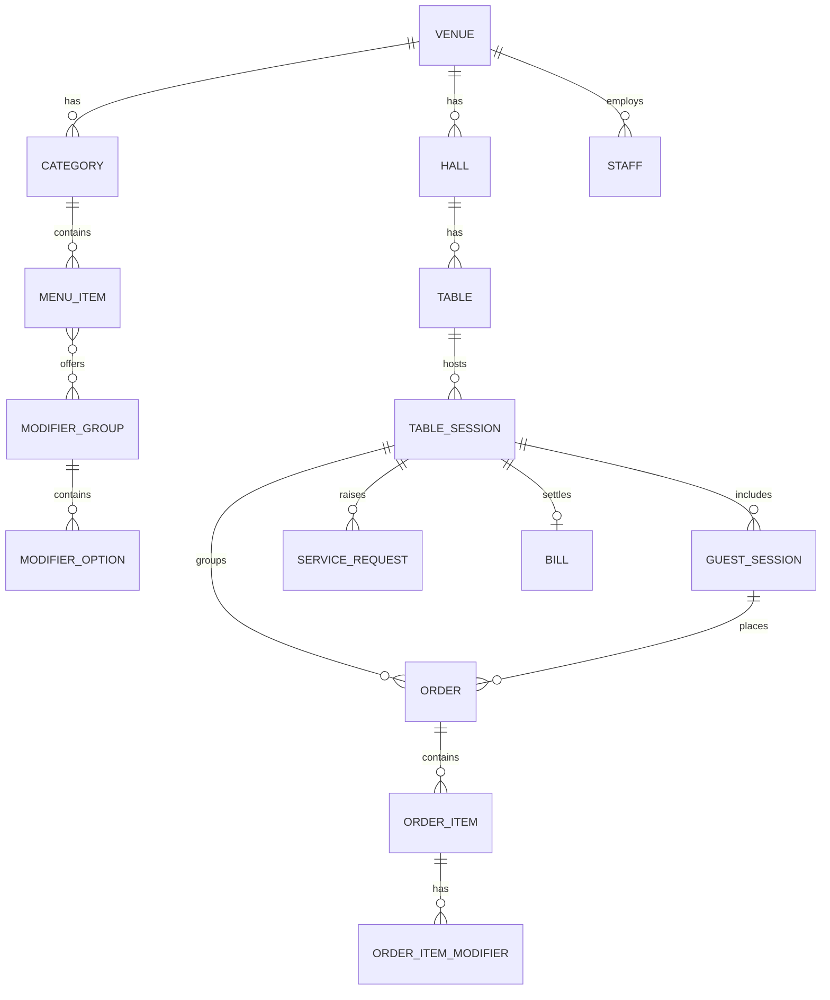
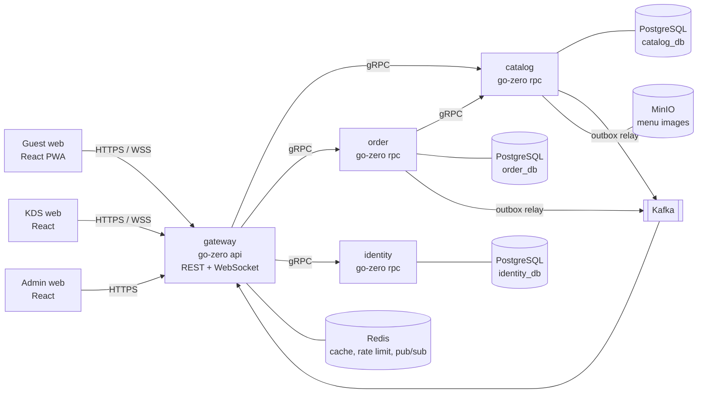
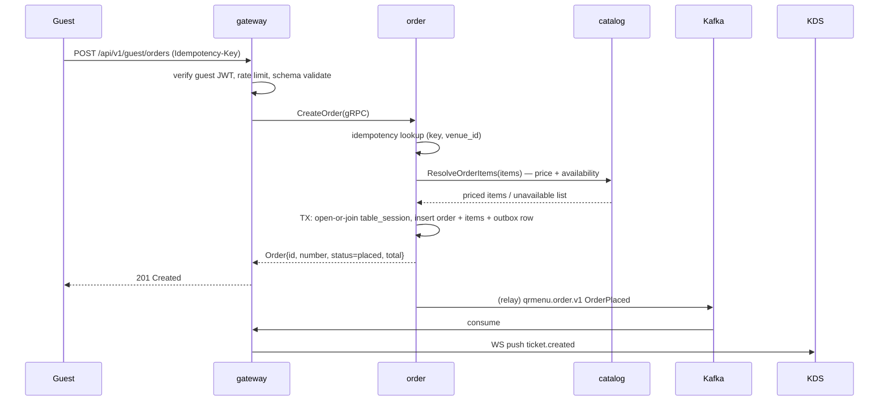
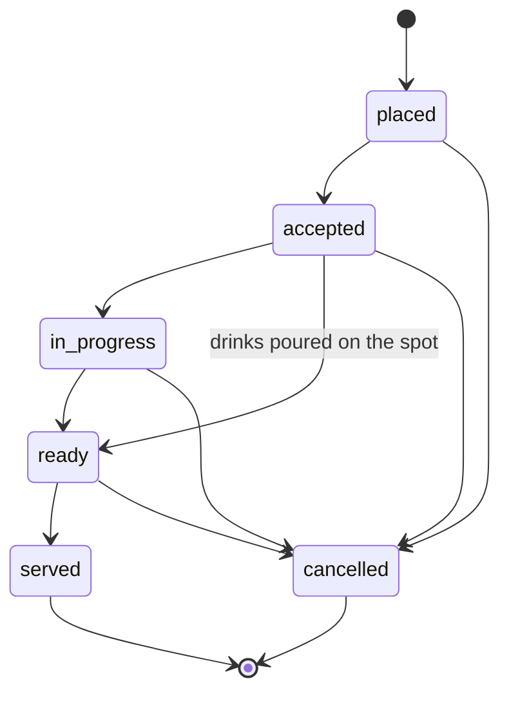

# QR Menu — Technical Specification (TZ)

| Field | Value |
|---|---|
| Product | QR Menu — contactless menu, ordering and kitchen display for cafés and restaurants |
| Document | Technical Specification (TZ), v1.0 |
| Status | Draft — for review |
| Scope | MVP (Release 1) |
| Date | 2026-08-31 |
| Owner | menli |
| Repository | https://github.com/menli02/QR-menu |

---

## 1. Summary

A guest scans a QR code printed on the table, opens a mobile web menu (no app install),
adds items to a cart, and places an order. The order appears within seconds on the
Kitchen Display System (KDS) in the kitchen. Kitchen staff move items through cooking
states; the guest sees live order status on the same page. The guest can also call a
waiter and request the bill from the phone. Payment itself happens off-system
(cash / card terminal at the table) in Release 1.

**Release 1 deliberately excludes online payments**, delivery/takeaway, loyalty,
POS integration and fiscal receipts. See §3.2 Non-goals.

### 1.1 Facts, assumptions, risks

**Facts (given).**
- Target architecture: microservices from day one, per organization standard.
- Backend stack: Go + go-zero, gRPC between services, PostgreSQL, Redis, Kafka, MinIO, Kubernetes.
- Frontends: React web (guest, KDS, admin). Native mobile apps are not part of Release 1.
- Repository is public — no secrets, no real customer data, no production dumps in the repo.

**Assumptions (to confirm — see §16).**
- A1. Single-country, single-currency per venue; currency is a venue setting.
- A2. Venue Wi-Fi is available but unreliable; both guest and KDS clients must survive
  short disconnects without losing data.
- A3. Kitchen uses a tablet or a wall-mounted screen with a modern browser; no native KDS app.
- A4. No fiscalization / receipt-printing legal requirement in Release 1. If required, it
  becomes a blocking dependency for a paid pilot.
- A5. Pilot scale: up to 20 venues × 50 tables, peak ≈ 30 orders/hour/venue.
- A6. Guests are anonymous. We do not collect name, phone or email in Release 1.

**Risks.**
- R1. *QR sticker cloning / off-premise ordering.* A photographed QR lets anyone order to that
  table remotely. Mitigation: signed table token + rate limits + staff confirmation step
  (§11.3). Full mitigation (rotating codes on a table screen) is out of scope for R1.
- R2. *Kitchen adoption.* If KDS is slower than paper tickets, staff abandon it. Mitigation:
  KDS must be operable with one tap per item and must work offline-read (§5.4).
- R3. *Menu content quality.* Photos and descriptions are the venue's responsibility;
  a bad menu kills conversion regardless of the software. Mitigation: admin UI enforces
  required fields, image guidelines, and a preview mode.
- R4. *Stale menu / stop-list.* Ordering an item the kitchen ran out of causes refunds and
  conflict. Mitigation: server-side availability re-check at order submit (§7.2, §12.2).
- R5. *Public repository.* Any accidental commit of a token or a dump is immediately public.
  Mitigation: secret scanning in CI, `.gitignore` for env files, placeholders only in docs.

---

## 2. Glossary

| Term | Meaning |
|---|---|
| **Venue** | A single café/restaurant location. Tenant boundary — every row carries `venue_id`. |
| **Table** | A physical table with a printed QR code. Belongs to a venue and a hall/zone. |
| **Table session** | Period during which one party occupies a table. Groups all orders into one bill. Opened on first order, closed by staff. |
| **Guest session** | Anonymous authenticated session of one phone at one table, inside a table session. |
| **Menu item** | A sellable dish or drink with price, category and optional modifiers. |
| **Modifier** | An option affecting an item (e.g. "no onion", "double shot"), may change price. |
| **Stop-list ("86")** | Set of items temporarily unavailable. Toggled by kitchen or manager. |
| **Order** | An immutable-priced set of order items placed at one moment by one guest session. |
| **Ticket** | The KDS representation of an order. One order = one ticket. |
| **Service request** | Guest-initiated call to staff: call waiter / request bill. |
| **Bill** | Read model: sum of all non-cancelled orders in a table session. |
| **KDS** | Kitchen Display System — the kitchen screen showing tickets. |

---

## 3. Goals and scope

### 3.1 Goals

| ID | Goal | Success metric (pilot, 1 venue, 1 month) |
|---|---|---|
| G1 | Let a guest order without waiting for a waiter | ≥ 40% of tables place ≥ 1 order via QR |
| G2 | Cut time from "guest decided" to "kitchen sees the order" | p95 < 5 s from submit to ticket on KDS |
| G3 | Remove order-transcription errors | 0 order-content complaints attributable to the system |
| G4 | Give the kitchen a single source of truth for the queue | ≥ 90% of tickets closed in KDS, not on paper |
| G5 | Reduce "where is my food / bring the bill" friction | Median waiter-call acknowledgement < 60 s |

### 3.2 Non-goals for Release 1 (explicitly out of scope)

Online payments and refunds; delivery and takeaway; table reservation; loyalty, coupons,
promo codes; POS / accounting / fiscal-printer integration; inventory and cost accounting;
staff scheduling and payroll; native iOS/Android apps; multi-venue chain reporting;
guest accounts and order history across visits; tips; printer-based (paper) kitchen tickets.

Each of these has a natural place in Release 2+ (§15) and the contracts in §8 are designed
not to block them.

---

## 4. Actors and user stories

### 4.1 Actors

| Actor | Client | Auth |
|---|---|---|
| **Guest** | Mobile web (`web/guest`) | Anonymous guest JWT bound to venue+table+session |
| **Waiter** | Mobile web (`web/kds`, floor view) | Staff JWT, role `waiter` |
| **Cook / kitchen** | Tablet or wall screen (`web/kds`) | Staff JWT, role `cook` |
| **Manager** | Desktop web (`web/admin`) | Staff JWT, role `manager` |
| **Venue admin/owner** | Desktop web (`web/admin`) | Staff JWT, role `admin` |
| **Platform operator** | CLI / runbooks | Out of product scope; K8s + DB access |

### 4.2 User stories (Release 1)

**Guest**
- US-G1. As a guest I scan the QR on my table and instantly see the menu of this venue,
  with the table number already recognised, without installing anything or signing in.
- US-G2. I browse by category, see photo, description, price, allergens and whether an item
  is available right now.
- US-G3. I add items to a cart, choose modifiers, set quantity and leave a comment
  ("no ice", "well done").
- US-G4. I submit the order and immediately get an order number and live status.
- US-G5. I add more items later; they join the same bill.
- US-G6. I press "Call waiter" or "Bring the bill" and see that the request was received.
- US-G7. I see the running total of everything ordered at my table.
- US-G8. If my connection drops, my cart is not lost and the page recovers status on reconnect.

**Kitchen (cook)**
- US-K1. New tickets appear on the KDS within seconds, sorted oldest-first, with table number,
  order number, items, modifiers and comments.
- US-K2. I accept a ticket, mark individual items as cooking → ready, and close the ticket.
- US-K3. I see how long each ticket has been waiting; overdue tickets are visually escalated.
- US-K4. I put an item on the stop-list when we run out; it disappears from the guest menu.
- US-K5. If the screen loses network, it shows a clear offline indicator and re-syncs on reconnect.

**Waiter**
- US-W1. I see active waiter calls and bill requests per table and acknowledge them.
- US-W2. I see ready orders to be delivered and mark them served.
- US-W3. I open the bill for a table, and after payment I mark it paid with a method
  (cash / card terminal) which closes the table session.
- US-W4. I can cancel an order or an item before it is cooking, with a reason.

**Manager / admin**
- US-A1. I create and edit categories, items, prices, modifiers, photos, allergens, and
  publish menu changes.
- US-A2. I manage tables and halls and print/download QR codes as a PDF sheet.
- US-A3. I manage staff accounts and roles.
- US-A4. I configure venue settings: name, logo, currency, locales, working hours,
  service charge %, order rules.
- US-A5. I see a basic day report: orders count, revenue by order, average ticket,
  top items, average cook time.

---

## 5. Functional requirements

Priority: **M** = must (Release 1), **S** = should (Release 1 if time allows), **C** = could (Release 2).

### 5.1 Catalog and menu

| ID | Pri | Requirement |
|---|---|---|
| FR-C1 | M | Category CRUD: name (per locale), sort order, visibility, optional image. |
| FR-C2 | M | Menu item CRUD: name and description per locale, base price (minor units), category, photo, allergen tags, `is_active`, sort order. |
| FR-C3 | M | Modifier groups: name, min/max selectable, required flag; options with price delta. An item references 0..N modifier groups. |
| FR-C4 | M | Availability toggle (stop-list) per item, settable from admin and from KDS; changes propagate to guest clients in ≤ 5 s. |
| FR-C5 | M | Guest menu read endpoint returns only active, visible, in-locale content for one venue, in a single response, cacheable. |
| FR-C6 | S | Menu versioning: publishing produces a new immutable `menu_version`; guest clients cache by version. |
| FR-C7 | S | Item scheduling (breakfast 08:00–11:00) via availability windows. |
| FR-C8 | C | Item options such as size variants modelled as modifier groups (no separate SKU concept in R1). |

### 5.2 Tables and QR

| ID | Pri | Requirement |
|---|---|---|
| FR-T1 | M | Table CRUD: label ("12", "Terrace-3"), hall/zone, seats, `is_active`. |
| FR-T2 | M | Each table has an immutable `table_code` (random, ≥ 10 chars, URL-safe) and a signature `sig` derived from an HMAC key with a `key_version`. |
| FR-T3 | M | QR export: PNG per table and a printable A4 PDF sheet for all tables of a hall, including venue logo and table label. |
| FR-T4 | M | Key rotation: rotating the venue HMAC key invalidates old QR codes and requires reprint; old `key_version` stays valid for a configurable grace period (default 30 days). |
| FR-T5 | S | Deactivating a table blocks new orders with a clear message and keeps history. |

### 5.3 Guest session and ordering

| ID | Pri | Requirement |
|---|---|---|
| FR-O1 | M | Opening a valid QR link issues an anonymous guest JWT bound to `venue_id`, `table_id`, `guest_session_id`; TTL 4 h, sliding on activity. |
| FR-O2 | M | Cart lives on the client (localStorage) and survives reload; it is never trusted for pricing. |
| FR-O3 | M | Order submit sends item ids, modifier option ids, quantity and comment only. The server resolves the current price and stores a **price snapshot** on every order item. |
| FR-O4 | M | Order submit is idempotent via a client-generated `Idempotency-Key` (UUIDv4); retries return the original result (§7.4). |
| FR-O5 | M | Server validates on submit: item exists, active, available, belongs to the venue; modifier selection satisfies min/max; quantity 1..99; comment ≤ 200 chars; items per order ≤ 50; order total ≤ venue limit. |
| FR-O6 | M | If any item became unavailable, submit fails with `409 ITEMS_UNAVAILABLE` and the exact item list. Partial acceptance is not allowed in R1. |
| FR-O7 | M | If a resolved price differs from the price the client displayed, submit fails with `409 PRICE_CHANGED` plus new totals; the guest re-confirms. |
| FR-O8 | M | On success the order gets a per-venue, per-business-day human number (`A-014`) and enters state `placed`. |
| FR-O9 | M | The first order at a free table opens a `table_session`; later orders from any guest at that table join it. |
| FR-O10 | M | The guest sees live order status and the running table total. |
| FR-O11 | S | Guest can cancel own order within `cancel_window` (default 60 s) while it is still `placed`. |
| FR-O12 | C | Split bill / per-guest bill. |

### 5.4 Kitchen display (KDS)

| ID | Pri | Requirement |
|---|---|---|
| FR-K1 | M | Ticket list per venue, filtered by station (`all` in R1), sorted by placed time ascending. |
| FR-K2 | M | New tickets arrive push-based (WebSocket) in ≤ 2 s p95, with an audible and visual alert. |
| FR-K3 | M | Per-ticket actions: accept, start, mark ready, close (served); per-item actions: cooking, ready, cancel. |
| FR-K4 | M | Elapsed timer per ticket; colour escalation at configurable thresholds (default green < 8 min, amber 8–15, red > 15). |
| FR-K5 | M | An order becomes `ready` automatically when all non-cancelled items are `ready`. |
| FR-K6 | M | Stop-list toggle directly from a ticket item ("86 this"). |
| FR-K7 | M | Offline mode: last state stays readable, a banner shows disconnection, actions are queued and replayed with idempotency keys on reconnect; conflicting server state wins and is shown. |
| FR-K8 | S | Recall of a closed ticket within 30 min. |
| FR-K9 | C | Multiple stations (bar/hot/cold) with per-station routing. |

### 5.5 Service requests and bill

| ID | Pri | Requirement |
|---|---|---|
| FR-S1 | M | Guest can create a service request of type `call_waiter` or `request_bill`. |
| FR-S2 | M | Rate limit: one open request per type per table; a repeat within 2 min returns the existing one. |
| FR-S3 | M | Staff floor view lists open requests with table, type, age; staff can `acknowledge` and `resolve`. |
| FR-S4 | M | Open requests auto-expire to `expired` after 15 min (configurable) and are logged. |
| FR-S5 | M | Bill view per table session: line items across orders, subtotal, service charge %, total. |
| FR-S6 | M | Staff marks the bill paid with method `cash` / `card_terminal` / `other`; this closes the table session and archives it. Amount received and change are not tracked in R1. |
| FR-S7 | S | `request_bill` carries a preferred payment method hint from the guest. |

### 5.6 Admin and reporting

| ID | Pri | Requirement |
|---|---|---|
| FR-A1 | M | Staff CRUD with roles `admin`, `manager`, `waiter`, `cook`; password policy per §11.3. |
| FR-A2 | M | Venue settings: name, logo, currency, locales, timezone, business-day cutoff, service charge %, KDS thresholds, order limits. |
| FR-A3 | M | Day report: orders, revenue, average ticket, top 10 items, average accept and cook time. |
| FR-A4 | M | Audit log of privileged actions (price change, order cancel, bill paid, staff role change) with actor, before/after, timestamp. |
| FR-A5 | S | CSV export of the day report. |

---

## 6. Domain model



Aggregate roots and their owning service:

| Aggregate | Owner service | Notes |
|---|---|---|
| Venue, Hall, Table, Category, MenuItem, ModifierGroup | `catalog` | Read-heavy, cacheable |
| TableSession, GuestSession, Order, OrderItem, ServiceRequest, Bill | `order` | Write-heavy, transactional |
| Staff, Role, Session/refresh token | `identity` | Auth only |

No cross-service foreign keys. `order` stores denormalized snapshots (item name, price,
modifier names) so that a menu edit never rewrites history.

---

## 7. Architecture

### 7.1 Services



| Service | Type | Responsibility | Why separate |
|---|---|---|---|
| `gateway` | go-zero **api** (REST + WS) | Edge: TLS termination behind ingress, authn, rate limiting, request validation, response shaping, WebSocket hubs, BFF aggregation | Only component exposed publicly; scales with connections, not with business load |
| `catalog` | go-zero **rpc** | Venues, halls, tables, categories, items, modifiers, availability, images | Read-dominated, aggressively cached, different scaling and deploy cadence |
| `order` | go-zero **rpc** | Table/guest sessions, orders, order state machine, service requests, bill | The transactional core; correctness-critical, isolated failure domain |
| `identity` | go-zero **rpc** | Staff accounts, roles, password hashing, token issue/refresh, guest token signing keys | Security-sensitive; smallest possible blast radius and audit surface |

**Explicitly not services in R1:** notification/realtime (lives in `gateway`), reporting
(read queries in `order` + `catalog`), media processing (synchronous resize in `catalog`).
Each is called out in §15 with the trigger that would justify extraction.

### 7.2 Key interaction flows

**Order submit (synchronous path).**



Timeouts: gateway→order 3 s, order→catalog 800 ms, DB statement 2 s. No retries on
`CreateOrder` inside the server (the client retries with the same idempotency key);
`ResolveOrderItems` is retried once (it is a pure read).

**Kitchen status change.** KDS → gateway (REST, staff JWT, idempotency key) → order
(state machine transition in one TX + outbox) → Kafka → gateway → WS push to the guest's
order channel and to all KDS clients of the venue.

**Availability toggle.** KDS/admin → gateway → catalog (TX + outbox) → Kafka
`qrmenu.catalog.v1 ItemAvailabilityChanged` → gateway → WS push to guest menu channel;
guest UI marks the item unavailable without a full menu reload.

### 7.3 Realtime design

- **Kafka** carries durable domain events (audit, analytics, future consumers). It is *not*
  the low-latency path to browsers.
- **gateway** instances consume Kafka with a **per-instance consumer group**
  (`gateway-<pod-name>`) so every instance receives every event and can push to the sockets
  it holds. Consumers are read-only and idempotent, so per-pod groups are safe.
  *Alternative considered:* Redis Pub/Sub fan-out. Rejected as the primary path because it
  would need its own delivery guarantees; kept as the fallback if per-pod groups become
  operationally noisy (see ADR-0003).
- WebSocket channels: `venue:{venue_id}:kds`, `venue:{venue_id}:menu`,
  `session:{table_session_id}` (guest). Subscription is authorised from the JWT claims;
  a guest can only subscribe to its own table session.
- Client reconnect: exponential backoff 1→30 s with jitter; on reconnect the client
  **re-fetches state over REST** and then resumes the socket. Sockets are an optimisation,
  never the source of truth.
- Guest fallback: if WS fails twice, poll `GET /api/v1/guest/orders` every 10 s.
- Heartbeat: ping every 25 s, drop after 2 missed pongs.

### 7.4 Idempotency, retries, timeouts

| Concern | Rule |
|---|---|
| Idempotency scope | All state-changing public endpoints require `Idempotency-Key` (UUIDv4). Key is scoped to `(venue_id, endpoint, key)`. |
| Storage | `order_db.idempotency_key` — key, request fingerprint (SHA-256 of canonical body), response status + body, `created_at`. TTL 24 h, purged by a daily job. |
| Replay | Same key + same fingerprint → stored response. Same key + different fingerprint → `409 IDEMPOTENCY_KEY_REUSED`. |
| In-flight | A second request while the first is running gets `409 REQUEST_IN_PROGRESS` (row lock with `SELECT ... FOR UPDATE NOWAIT`). |
| Retries | Clients retry `5xx`/timeouts with backoff and the same key. Servers do not retry writes. Reads may be retried once. |
| Timeouts | Browser→gateway 10 s; gateway→rpc 3 s; rpc→rpc 800 ms; DB statement 2 s; `lock_timeout` 1 s. |
| Circuit breaking | go-zero built-in breaker on every gRPC client; `catalog` unavailable → order submit fails fast with `503 CATALOG_UNAVAILABLE`, KDS keeps working on already-placed orders. |

---

## 8. Contracts

Contracts are long-lived interfaces. Rules: additive changes only within a major version;
`buf breaking` runs in CI against `main`; a breaking change requires a new package version
(`order.v2`) and a documented migration window. Never reuse or renumber a proto field.

### 8.1 Public REST API (gateway, `/api/v1`)

Money is always integer **minor units** plus an ISO-4217 `currency`. All timestamps are
RFC 3339 UTC. All list endpoints are cursor-paginated.

**Guest (auth: guest JWT in `Authorization: Bearer`, issued from the QR link)**

| Method | Path | Purpose | Notes |
|---|---|---|---|
| `POST` | `/guest/sessions` | Exchange `{venue_slug, table_code, sig}` for a guest JWT | Rate limited per IP; validates HMAC |
| `GET` | `/guest/menu` | Full menu for the venue in the requested locale | `ETag` + `Cache-Control: max-age=60`; returns `menu_version` |
| `POST` | `/guest/orders` | Place an order | `Idempotency-Key` required |
| `GET` | `/guest/orders` | Orders of the current table session with statuses | |
| `POST` | `/guest/orders/{id}/cancel` | Cancel own order inside the cancel window | |
| `GET` | `/guest/bill` | Current table-session bill | |
| `POST` | `/guest/service-requests` | `{type: call_waiter\|request_bill}` | Rate limited |
| `WS` | `/ws/guest` | Live order and menu updates | Token in the first message, not the query string |

**Staff (auth: staff JWT; role checks per §11.3)**

| Method | Path | Purpose |
|---|---|---|
| `POST` | `/auth/login` / `/auth/refresh` / `/auth/logout` | Session lifecycle |
| `GET` | `/kds/tickets?status=active` | Ticket list for the venue |
| `POST` | `/kds/orders/{id}/transition` | `{to: accepted\|in_progress\|ready\|served\|cancelled, reason?}` |
| `POST` | `/kds/order-items/{id}/transition` | `{to: cooking\|ready\|cancelled, reason?}` |
| `POST` | `/kds/items/{item_id}/availability` | Stop-list toggle |
| `GET` | `/floor/service-requests?status=open` | Open guest requests |
| `POST` | `/floor/service-requests/{id}/transition` | `{to: acknowledged\|resolved}` |
| `GET` | `/floor/tables` | Table map with session state and totals |
| `GET` | `/floor/table-sessions/{id}/bill` | Bill for a table |
| `POST` | `/floor/table-sessions/{id}/close` | `{payment_method}` — marks paid, closes session |
| `WS` | `/ws/staff` | Ticket and service-request stream |

**Admin (role `manager`/`admin`)** — CRUD under `/admin/categories`, `/admin/items`,
`/admin/modifier-groups`, `/admin/tables`, `/admin/halls`, `/admin/staff`,
`/admin/venue`, plus `GET /admin/reports/day?date=`, `GET /admin/tables/qr.pdf`.

**Error envelope** (all non-2xx):

```json
{
  "error": {
    "code": "ITEMS_UNAVAILABLE",
    "message": "Some items are no longer available",
    "details": [{"item_id": "…", "name": "Latte"}],
    "trace_id": "6f1c…"
  }
}
```

Codes are a closed, documented set (`VALIDATION_FAILED`, `UNAUTHENTICATED`, `FORBIDDEN`,
`NOT_FOUND`, `ITEMS_UNAVAILABLE`, `PRICE_CHANGED`, `INVALID_TRANSITION`,
`IDEMPOTENCY_KEY_REUSED`, `REQUEST_IN_PROGRESS`, `RATE_LIMITED`, `TABLE_INACTIVE`,
`SESSION_CLOSED`, `CATALOG_UNAVAILABLE`, `INTERNAL`). HTTP status is derived from the code.

### 8.2 gRPC (internal)

Sketch — full definitions live in `proto/`, generated with `buf` + `goctl`.

```protobuf
// proto/catalog/v1/catalog.proto
service CatalogService {
  rpc GetMenu(GetMenuRequest) returns (GetMenuResponse);
  rpc ResolveOrderItems(ResolveOrderItemsRequest) returns (ResolveOrderItemsResponse);
  rpc SetItemAvailability(SetItemAvailabilityRequest) returns (SetItemAvailabilityResponse);
  rpc ResolveTable(ResolveTableRequest) returns (ResolveTableResponse);
}

message ResolveOrderItemsRequest {
  string venue_id = 1;
  repeated RequestedItem items = 2;   // item_id, qty, modifier_option_ids, comment
  string locale = 3;
}
message ResolveOrderItemsResponse {
  repeated ResolvedItem items = 1;    // snapshot: name, unit_price_minor, modifiers, line_total
  repeated UnavailableItem unavailable = 2;
  int64 total_minor = 3;
  string currency = 4;
  string menu_version = 5;
}
```

```protobuf
// proto/order/v1/order.proto
service OrderService {
  rpc CreateOrder(CreateOrderRequest) returns (Order);              // idempotency_key required
  rpc TransitionOrder(TransitionOrderRequest) returns (Order);
  rpc TransitionOrderItem(TransitionOrderItemRequest) returns (Order);
  rpc ListTickets(ListTicketsRequest) returns (ListTicketsResponse);
  rpc GetTableSession(GetTableSessionRequest) returns (TableSession);
  rpc CloseTableSession(CloseTableSessionRequest) returns (TableSession);
  rpc CreateServiceRequest(CreateServiceRequestRequest) returns (ServiceRequest);
  rpc TransitionServiceRequest(TransitionServiceRequestRequest) returns (ServiceRequest);
  rpc GetDayReport(GetDayReportRequest) returns (DayReport);
}
```

```protobuf
// proto/identity/v1/identity.proto
service IdentityService {
  rpc Login(LoginRequest) returns (TokenPair);
  rpc Refresh(RefreshRequest) returns (TokenPair);
  rpc Revoke(RevokeRequest) returns (RevokeResponse);
  rpc GetStaff(GetStaffRequest) returns (Staff);
  rpc ListJWKS(ListJWKSRequest) returns (JWKS);   // gateway verifies tokens offline
}
```

Conventions: every request carries `venue_id` where applicable; every response of a mutation
returns the full updated aggregate (no partial patches); enums always have a `_UNSPECIFIED = 0`
member; `google.protobuf.Timestamp` for time; money as `int64` minor units + `string currency`.

### 8.3 Kafka events

| Topic | Key | Partitions (pilot) | Retention | Producer |
|---|---|---|---|---|
| `qrmenu.order.v1` | `order_id` | 6 | 7 d | `order` |
| `qrmenu.service_request.v1` | `table_id` | 3 | 7 d | `order` |
| `qrmenu.catalog.v1` | `item_id` | 3 | 7 d | `catalog` |
| `qrmenu.<topic>.dlq` | original key | 1 | 30 d | consumers |

Envelope (JSON in R1; a schema registry with Protobuf is a Release 2 item):

```json
{
  "event_id": "uuid",
  "event_type": "order.placed",
  "schema_version": 1,
  "occurred_at": "2026-08-31T10:12:03Z",
  "venue_id": "uuid",
  "trace_id": "…",
  "payload": { }
}
```

Event types R1: `order.placed`, `order.transitioned`, `order.item_transitioned`,
`order.cancelled`, `table_session.opened`, `table_session.closed`,
`service_request.created`, `service_request.transitioned`,
`catalog.item_availability_changed`, `catalog.menu_published`.

Delivery rules:
- **Producing:** transactional outbox. The domain write and the `outbox` insert happen in one
  Postgres transaction; a relay goroutine publishes and marks rows sent. No event is ever
  published for a rolled-back transaction, and no transaction is lost if Kafka is down.
- **Consuming:** at-least-once, therefore every consumer is idempotent. Dedupe by `event_id`
  (Redis `SETNX` with 24 h TTL, backed by a unique constraint where a DB write is involved).
- **Ordering:** guaranteed per key only. Consumers must tolerate out-of-order arrival across
  keys and use `occurred_at` + state-machine guards rather than assuming order.
- **Failure:** 5 attempts with exponential backoff (1s, 2s, 4s, 8s, 16s), then the message
  goes to the topic's DLQ with the failure reason in headers. DLQ depth is alerted on.
- **Replay:** all consumers must be safe to replay from the beginning of retention.
- **Versioning:** additive fields only; a breaking payload change means a new topic suffix
  (`qrmenu.order.v2`) with dual-publishing during migration.

---

## 9. Data model

PostgreSQL 16. **Database per service** on a shared cluster in the pilot
(`catalog_db`, `order_db`, `identity_db`), each with its own role and its own migration
directory under `migrations/`. No cross-database queries and no cross-service foreign keys:
ids owned by another service (`table_id`, `menu_item_id`, `staff_id`) are stored as plain
UUIDs. Extraction to separate clusters requires no code change.

Conventions: `id uuid` primary keys, `venue_id uuid NOT NULL` on every tenant-scoped table,
`created_at`/`updated_at timestamptz` with a shared `set_updated_at()` trigger,
money as `*_minor bigint` plus `currency char(3)`. Table names are plural and avoid SQL
reserved words, so no query depends on quoting. Every query is filtered by `venue_id`.

The **Status** column below states what exists in `migrations/` today, so the spec can be
read as the contract *and* as an honest inventory.

### 9.1 `catalog_db`

| Table | Key columns | Notable indexes | Status |
|---|---|---|---|
| `venues` | `slug` uniq, `name`, `currency`, `locales[]`, `default_locale`, `timezone`, `business_day_cutoff_minute`, `service_charge_bps`, `order_item_comment_max_len`, `order_total_limit_minor`, `cancel_window_seconds`, `kds_amber/red_threshold_seconds`, `menu_version` | `uniq(slug)` | ✅ |
| `venue_qr_keys` | `venue_id`, `key_version`, `secret bytea`, `expires_at` | pk `(venue_id, key_version)`, partial `uniq(venue_id) WHERE expires_at IS NULL` | ✅ |
| `halls` | `venue_id`, `name`, `sort_order`, `is_active` | `(venue_id, sort_order)` | ✅ |
| `tables` | `venue_id`, `hall_id`, `label`, `seats`, `is_active`, `table_code`, `key_version` | `uniq(venue_id, table_code)`, `(venue_id, hall_id)`, FK `(venue_id, key_version) → venue_qr_keys` | ✅ |
| `categories` | `venue_id`, `name jsonb` (per locale), `sort_order`, `is_visible`, `image_url` | `(venue_id, sort_order)` | ✅ |
| `menu_items` | `venue_id`, `category_id`, `name jsonb`, `description jsonb`, `base_price_minor`, `image_url`, `allergens[]`, `is_active`, `is_available`, `sort_order` | `(venue_id, is_active, is_available)`, `(venue_id, category_id, sort_order)` | ✅ |
| `availability_windows` | `item_id`, `start_minute_of_day`, `end_minute_of_day` | `(item_id)` | ✅ schema, FR-C7 logic pending |
| `modifier_groups` | `item_id`, `name jsonb`, `min_select`, `max_select`, `required` | `(item_id)` | ✅ |
| `modifier_options` | `group_id`, `name jsonb`, `price_delta_minor`, `sort_order` | `(group_id, sort_order)` | ✅ |
| `outbox` | `id` (= `event_id`), `event_type`, `schema_version`, `venue_id`, `topic`, `partition_key`, `payload jsonb`, `trace_id`, `occurred_at`, `sent_at`, `attempts`, `last_error`, `next_attempt_at` | partial `(next_attempt_at, occurred_at) WHERE sent_at IS NULL` | ✅ |

Two decisions differ from the earlier draft of this document and are now binding:

- **A modifier group belongs to exactly one menu item.** §6's ER diagram shows a
  many-to-many relation, but every RPC in `catalog.proto` addresses a group through its
  owning `item_id` and no group-reuse endpoint exists. The schema follows the proto, which is
  the binding contract. Reusable groups (one "Milk" group shared by every coffee) become a
  join table in Release 2 — see ADR-0007.
- **`service_charge_bps`, not a percentage.** Basis points avoid a rounding class of bug on
  bills; `500` = 5.00%.

`menu_version` is a per-venue `bigint` bumped by catalog's write path inside the same
transaction as any menu change — not a trigger, so a no-op update can deliberately skip the
bump. `order_db` stores it as `TEXT` so order history never depends on catalog's internal
representation.

### 9.2 `order_db`

| Table | Key columns | Notable indexes | Status |
|---|---|---|---|
| `table_sessions` | `venue_id`, `table_id`, `status`, `opened_at`, `closed_at`, `closed_by_staff_id`, `payment_method`, `currency`, `total_minor` | partial `uniq(table_id) WHERE status='open'`, `(venue_id, status)` | ✅ |
| `guest_sessions` | `id` (= JWT `sid`), `venue_id`, `table_id`, `table_session_id`, `issued_at`, `expires_at`, `last_seen_at`, `revoked_at` | `(table_session_id)` | ✅ |
| `order_number_counters` | `venue_id`, `business_date`, `next_seq` | pk `(venue_id, business_date)` | ✅ |
| `orders` | `venue_id`, `table_id`, `table_session_id`, `guest_session_id`, `business_date`, `number`, `status`, `total_minor`, `currency`, `menu_version`, `cancelled_reason`, `placed_at`, `accepted_at`, `ready_at`, `served_at` | `uniq(venue_id, business_date, number)`, `(venue_id, status, placed_at)`, `(table_session_id)`, `(venue_id, business_date)` | ✅ |
| `order_items` | `order_id`, `menu_item_id`, `name`, `unit_price_minor`, `qty`, `comment`, `status`, `line_total_minor` | `(order_id)` | ✅ |
| `order_item_modifiers` | `order_item_id`, `option_id`, `name`, `price_delta_minor` | `(order_item_id)` | ✅ |
| `service_requests` | `venue_id`, `table_id`, `table_session_id`, `type`, `status`, `note`, `created_at`, `acknowledged_at`, `resolved_at`, `expires_at` | partial `uniq(table_id, type) WHERE status='open'`, `(venue_id, status, created_at)` | ✅ |
| `idempotency_keys` | `venue_id`, `endpoint`, `key`, `fingerprint`, `in_progress`, `status_code`, `response_body jsonb` | pk `(venue_id, endpoint, key)`, `(created_at)` for TTL purge | ✅ |
| `outbox` | identical shape to `catalog_db.outbox` — one relay implementation (`pkg/outbox`) serves both | partial `(next_attempt_at, occurred_at) WHERE sent_at IS NULL` | ✅ |
| `order_events` | transition log: `order_id`, `from_status`, `to_status`, `actor_type`, `actor_id`, `reason`, `created_at` | `(order_id, created_at)` | ❌ **not implemented** — FR-A4 audit trail has no storage yet |

The **partial unique indexes** are what make "one open session per table" and "one open
service request per (table, type)" database guarantees rather than application hopes.

Order numbering: inside the order transaction, an upsert on `order_number_counters`
returns and increments `next_seq`, serialised per venue-day. No advisory locks, no gaps in
the common path. `business_date` is derived from the venue timezone and
`business_day_cutoff_minute`, so a venue that closes at 03:30 keeps one shift on one
business day (edge case 27).

Snapshots on `order_items` / `order_item_modifiers` (`name`, `unit_price_minor`,
`price_delta_minor`) make order history immutable and independent of later menu edits.
`menu_item_id` and `option_id` are kept for analytics only — they are never re-resolved.

### 9.3 `identity_db`

| Table | Key columns | Notable indexes | Status |
|---|---|---|---|
| `staff` | `venue_id`, `name`, `email citext`, `password_hash`, `role`, `is_active` | `uniq(venue_id, email)`, `(venue_id)` | ✅ |
| `refresh_tokens` | `staff_id`, `token_hash`, `issued_at`, `expires_at`, `revoked_at`, `replaced_by` | `uniq(token_hash)`, `(staff_id)`, `(expires_at)` for cleanup | ✅ |
| `signing_keys` | `kid`, `kty`, `alg`, `public_jwk`, `is_active`, `retired_at` | partial `uniq(is_active) WHERE is_active` | ✅ |
| lockout columns on `staff` (`failed_attempts`, `locked_until`) | — | — | ❌ **not implemented** — FR-A1 lockout has no storage yet |

`signing_keys` stores **public JWK material only**. Private keys live in the secret store and
are referenced by `kid` (§11.5) — deliberately unlike `venue_qr_keys.secret`, which is a
server-only HMAC secret never handed to a client and therefore acceptable in the database.
`replaced_by` makes refresh-token rotation a chain, so reuse of a rotated token is detectable
and revokes the whole family.

### 9.4 Transactions and migrations

- **Transaction boundaries.** One aggregate per transaction: order + items + modifiers +
  counter + idempotency row + outbox row commit together. Cross-service consistency is
  eventual, via events; there is no distributed transaction anywhere in the system.
- **Isolation.** `READ COMMITTED`. Order creation takes `SELECT ... FOR UPDATE` on the open
  `table_session` row, which serialises concurrent submits from several phones at one table.
- **Migrations.** `golang-migrate`, `NNNNNN_name.up.sql` / `.down.sql` per service, applied by
  a Kubernetes Job (`deploy/k8s/migrate-job.yaml`) before the rollout.
  Rules: additive first (add nullable column → backfill → constrain in a later release);
  never drop a column in the same release that stops using it; no migration may hold an
  exclusive lock longer than 1 s (`CREATE INDEX CONCURRENTLY`, `SET lock_timeout`).
  `000004_business_day_cutoff` is the pattern to copy: a new column whose `DEFAULT` reproduces
  the exact previous behaviour, so it deploys ahead of the code that reads it.
- **Rollback.** Every migration has a tested `down`. Because migrations are additive, rolling
  back the *application* never requires rolling back the *schema* — that is the supported
  path; `down` exists for local development and emergencies.

---

## 10. State machines

The order and item machines live as plain data in
`services/order/internal/logic/orderservice/statemachine.go` and are covered by
`statemachine_test.go`. This section and that file must not diverge.

### 10.1 Order



| Rule | Definition |
|---|---|
| Terminal states | `served`, `cancelled`. |
| `accepted → ready` | Allowed, skipping `in_progress`: a drink poured immediately has no meaningful cooking phase, and FR-K3 lists "mark ready" as a ticket action, not a step that must follow "start". |
| Cancellation | Allowed from **every** non-terminal state, including `ready`. Cancelling a ready dish is a real event (the party left, the guest refused it); a machine that forbids it pushes staff into marking food served that never was, which corrupts the day report far worse than an honest late cancellation. Reason required once cooking has started. See ADR-0008. |
| Auto-derived | `deriveOrderStatus` moves an order to `ready` when every non-cancelled line is `ready`, and to `cancelled` when every line is cancelled (FR-K5). It only ever moves **forward** — it never pulls an order back off `ready` if a line is reopened, because the rule exists to save the kitchen a tap, not to override a human. |
| Actors | Guest may only drive `placed → cancelled`, within `cancel_window_seconds` (default 60). All other transitions are staff-only; cancellation after cooking started is `manager`+ (§11.3). |
| No-op | `from == to` is an idempotent success handled before the machine is consulted — a retried request must never read as a client error. |
| Invalid | `409 INVALID_TRANSITION` carrying the current status. Never a silent no-op. |
| FR-K8 recall | `served → ready` is **not** wired: it is a Should, and no RPC carries the recall intent. Adding it means a new RPC, not a machine edit. |

### 10.2 Order item

`placed → cooking → ready`, with `cancelled` reachable from `placed`, `cooking` and `ready`.
`placed → ready` is allowed directly. There is no item-level `served`: delivery is an
order-level fact. Item transitions drive order transitions, never the reverse.

### 10.3 Table session

`open → closed`. Opened by the first order, or by a service request at a table with no open
session. Closed by staff with a `payment_method`; `closed_by_staff_id` and `closed_at` are
recorded. Closing requires every order in the session to be `served` or `cancelled`,
otherwise `409 SESSION_HAS_ACTIVE_ORDERS` (overridable by `manager` with a reason).
A closed session rejects new orders from its guest sessions with `409 SESSION_CLOSED`;
the guest UI then offers a rescan. `currency` is snapshotted at open time, so a venue
currency change cannot rewrite an open bill.

### 10.4 Service request

`open → acknowledged → resolved`, and `open|acknowledged → expired` once `expires_at`
passes (default 15 min, venue-configurable), applied by a periodic job.
Creating a request while one of the same type is `open` returns the **existing** request
with `200`, not `201` — which is what makes a guest's repeated taps harmless.

---

## 11. Non-functional requirements

### 11.1 Performance and capacity

| Metric | Target (p95) | Notes |
|---|---|---|
| Guest menu first contentful paint on 4G | < 1.5 s | Menu JSON < 150 KB gzipped; images lazy, WebP, ≤ 60 KB each |
| `GET /guest/menu` server time | < 120 ms | Redis-cached by `(venue_id, locale, menu_version)`, TTL 5 min, invalidated by a `menu_version` bump |
| `POST /guest/orders` server time | < 500 ms | Includes the `catalog.ResolveOrderItems` round-trip |
| Submit → ticket visible on KDS | < 2 s | End-to-end, alerted on |
| KDS action → confirmed | < 300 ms | |
| Capacity (pilot) | 20 venues, 1000 tables, 600 orders/hour aggregate | Sizing headroom ×10 |
| Gateway concurrent WebSockets | 2000 per pod, 3 pods minimum | |

### 11.2 Availability and degradation

Target 99.5% monthly for the guest path during venue working hours.

| Failure | Behaviour |
|---|---|
| `catalog` down | Menu served from Redis cache if warm; new orders rejected with `503 CATALOG_UNAVAILABLE` and a clear message; KDS fully functional on existing orders |
| `order` down | Menu browsable; ordering and KDS actions unavailable behind an explicit banner; the client keeps the cart |
| Kafka down | Writes succeed — the outbox buffers and `next_attempt_at` backs off; realtime push stops; KDS falls back to 10 s polling; events flush on recovery |
| Redis down | Rate limiting fails **closed** for guest ordering (protecting the kitchen is worth more than an order); menu cache misses fall through to Postgres |
| Guest offline | Cart preserved in localStorage; submit disabled behind an offline indicator |
| KDS offline | Last ticket state stays readable; actions queue locally with idempotency keys and replay on reconnect; server state wins on conflict and the screen shows what changed |

Kafka is deliberately **not** a readiness dependency: a broker outage must not remove
serving pods from the load balancer.

### 11.3 Security

**Authentication.**
- Guest: RS256 JWT, `aud=guest`, TTL 4 h, claims `venue_id`, `table_id`, `table_session_id`,
  `sid` (= `guest_sessions.id`). Stored in `sessionStorage`, not a cookie — which removes
  CSRF from the guest path entirely. No refresh; expiry means rescanning the QR.
- Staff: access JWT 15 min + rotating refresh token 30 d. Refresh lives in an
  `HttpOnly; Secure; SameSite=Strict` cookie; `refresh_tokens.replaced_by` makes reuse of a
  rotated token detectable and revokes the whole family. Passwords: Argon2id
  (m=64 MiB, t=3, p=2), minimum 12 characters, checked against a breached-password list.
  *Lockout after 10 failed attempts for 15 minutes is specified but not yet implemented —
  see the gap in §9.3.*
- The gateway verifies JWTs **offline** against JWKS from `identity` (cached 10 min), so an
  `identity` outage cannot take down authenticated traffic.

**Authorisation (RBAC).**

| Capability | guest | cook | waiter | manager | admin |
|---|---|---|---|---|---|
| Read own table's orders and bill | ✅ | — | — | — | — |
| Place order / service request | ✅ | — | — | — | — |
| Cancel own order inside the window | ✅ | — | — | — | — |
| View KDS tickets | — | ✅ | ✅ | ✅ | ✅ |
| Item and order cooking transitions | — | ✅ | ✅ | ✅ | ✅ |
| Toggle stop-list | — | ✅ | — | ✅ | ✅ |
| Mark served, acknowledge service requests | — | — | ✅ | ✅ | ✅ |
| Close bill / table session | — | — | ✅ | ✅ | ✅ |
| Cancel after cooking started | — | — | — | ✅ | ✅ |
| Menu and price editing | — | — | — | ✅ | ✅ |
| Staff, venue settings, QR key rotation | — | — | — | — | ✅ |

Every authorisation decision additionally checks that the resource's `venue_id` equals the
token's `venue_id`. Cross-venue access returns `404`, never `403` — no existence disclosure.
Role checks are enforced in the gateway middleware **and** re-checked in the owning service:
a service must never trust a caller's claim about who it is.

**QR / table-token security (mitigates R1).**
- The QR encodes `https://<host>/t/{venue_slug}/{table_code}?s={sig}`, where `sig` is an
  HMAC-SHA256 over `venue_id|table_id|key_version` using `venue_qr_keys.secret`.
- `table_code` is ≥ 10 random URL-safe characters (DB `CHECK`), unique per venue — never the
  table number, so codes are not guessable.
- Key rotation writes a new `venue_qr_keys` row and stamps `expires_at` on the old one
  (default 30-day grace, FR-T4). Use of a legacy key increments a metric so staff know
  reprints are outstanding.
- Rate limits (Redis, go-zero `periodlimit`): guest-session issue 10/min per IP; order submit
  5 per 10 min per guest session and 20 per 10 min per table; service requests 1 per type per
  2 min per table; 60 req/min per session overall.
- Venue setting `require_staff_confirmation` (default **on** for the pilot) keeps a human
  between a remote troll order and the kitchen.

**Transport and headers.** TLS 1.2+ at the ingress, HSTS, CSP without `unsafe-inline`,
`X-Content-Type-Options: nosniff`, `Referrer-Policy: strict-origin-when-cross-origin`,
strict per-venue CORS allowlist. Internal gRPC runs inside a `NetworkPolicy`-fenced namespace
(`deploy/k8s/networkpolicy.yaml`); **mTLS between services is a known gap** until a mesh or
per-service certificates land.

**Input handling.** Validated at the gateway against the schema *and* re-validated in the
owning service, with the hard limits also expressed as DB `CHECK` constraints (`qty 1..99`,
`comment ≤ 200`, all money `>= 0`) so no code path can write an impossible row.
Parameterised SQL only. Uploaded images are MIME-sniffed, capped at 5 MB, re-encoded
server-side (stripping EXIF including GPS) and stored under a random MinIO key.

### 11.4 Privacy

- No name, phone, email or payment data is collected from guests in Release 1.
- Guest sessions store no IP or User-Agent today. If abuse control later needs them, they are
  stored **hashed** (HMAC with a rotating salt), retained 30 days — and nothing else.
- Order data is retained 12 months, then aggregated and the raw rows deleted.
- Logs never contain tokens, `Authorization` headers, cookies, or `venue_qr_keys.secret`;
  a redaction middleware enforces this and is unit-tested.
- No third-party analytics or trackers on the guest page.

### 11.5 Secrets

All secrets arrive as environment variables from Kubernetes Secrets
(`deploy/k8s/secrets.example.yaml` is a placeholder template — the real values never enter
the repository). JWT private keys live in the secret store and are referenced by `kid`;
`signing_keys` holds public JWK material only. `.env.example` carries placeholders
(`<DB_PASSWORD>`, `<JWT_PRIVATE_KEY_REF>`, `<HMAC_KEY>`). CI runs secret scanning on every
push. **This repository is public — treat every commit as published forever.**

### 11.6 Observability

- **Logs**: structured JSON via go-zero `logx`, every line carrying `trace_id`, `venue_id`,
  `service`, `endpoint`. No PII (§11.4).
- **Metrics** (Prometheus): RED per endpoint and per gRPC method, plus product SLIs —
  `order_submit_total{result}`, `order_submit_duration_seconds`,
  `ticket_visible_delay_seconds`, `time_to_accept_seconds`, `cook_duration_seconds`,
  `service_request_ack_seconds`, `ws_connections`, `kafka_consumer_lag`, `outbox_pending`,
  `outbox_attempts`, `dlq_depth`, `qr_legacy_key_used`.
- **Tracing**: OpenTelemetry, W3C `traceparent` propagated browser → gateway → gRPC → Kafka
  headers (`trace_id` is a first-class outbox column) → consumer. 100% sampling in the pilot.
- **Correlation**: the gateway generates `X-Request-Id` when absent and returns it in every
  response and error envelope, so a guest complaint maps to a trace in one lookup.
- **Health**: `/healthz` (liveness, no dependencies) and `/readyz` (Postgres, Redis, required
  gRPC clients — not Kafka), implemented once in `pkg/health`.
- **Alerts**: order submit error rate > 2% for 5 min; ticket delay p95 > 5 s; DLQ depth > 0;
  `outbox_pending` > 100 for 2 min; consumer lag > 1000; 5xx > 1%; WebSocket disconnect storm.

### 11.7 Frontend requirements

- **Guest**: React + Vite PWA, mobile-first, first load ≤ 200 KB JS gzipped, iOS Safari 15+
  and Chrome 100+, venue-configured locales, WCAG 2.1 AA (contrast, visible focus, touch
  targets ≥ 44 px, labelled controls).
- **KDS**: built for a 10" tablet in landscape — high contrast, ≥ 18 px base font, one tap per
  action, confirmation on destructive actions, wake-lock to keep the screen on, explicit
  offline banner.
- **Admin**: desktop-first, optimistic updates with rollback on error, unsaved-changes guard.

---

## 12. Edge cases and negative scenarios

Acceptance-relevant: each row must have a test (§13).

### 12.1 QR and session

| # | Scenario | Required behaviour |
|---|---|---|
| 1 | Invalid or tampered `sig` | `401 INVALID_TABLE_TOKEN`, generic message, logged with the table code |
| 2 | QR of a deactivated table | `409 TABLE_INACTIVE`, "please ask a staff member" |
| 3 | QR signed with a rotated key inside the grace period | Works, and increments `qr_legacy_key_used` so staff know reprints are outstanding |
| 4 | QR signed with a key past `expires_at` | `401`; the guest sees "this QR is out of date" |
| 5 | Guest JWT expires mid-session | `401 TOKEN_EXPIRED`; the page silently re-runs the QR exchange from the stored link and retries once |
| 6 | Two phones at one table | Both join the same `table_session`; each sees the whole table bill but may cancel only its own orders |
| 7 | Staff closes the bill while a guest is mid-cart | `409 SESSION_CLOSED`; the cart survives and the guest is offered a rescan |

### 12.2 Ordering and concurrency

| # | Scenario | Required behaviour |
|---|---|---|
| 8 | Two phones submit simultaneously at one table | Both succeed; `SELECT FOR UPDATE` on the session serialises `order_number_counters`; no duplicate number |
| 9 | Network retry of the same submit | Same `Idempotency-Key` → exactly one order, the original response replayed |
| 10 | Same key, different body | `409 IDEMPOTENCY_KEY_REUSED` (fingerprint mismatch); nothing written |
| 11 | Retry while the first request is still running | `in_progress = true` → `409 REQUEST_IN_PROGRESS`; the client backs off |
| 12 | Item goes on the stop-list between menu load and submit | `409 ITEMS_UNAVAILABLE` listing exactly those items; nothing written; no partial acceptance |
| 13 | Price changed between menu load and submit | `409 PRICE_CHANGED` with new totals; the guest re-confirms; the server price always wins |
| 14 | Client sends a price or a total | Ignored entirely; a test asserts a forged price cannot influence the stored order |
| 15 | Modifier selection violates `min_select`/`max_select` | `422 VALIDATION_FAILED` naming the group |
| 16 | Item belongs to another venue | `404` — no cross-tenant existence disclosure |
| 17 | 60 items, or qty 500, or a 5 KB comment | `422` against FR-O5 limits, which are also DB `CHECK`s |
| 18 | Guest cancels at the same moment the cook accepts | One transaction wins under a status guard; the loser gets `409 INVALID_TRANSITION` with the current status |
| 19 | Negative modifier makes a line total negative | Rejected by the domain and by `CHECK (line_total_minor >= 0)` |
| 20 | Venue currency differs from the session currency | Impossible by construction: `table_sessions.currency` is snapshotted at open time |

### 12.3 Kitchen and realtime

| # | Scenario | Required behaviour |
|---|---|---|
| 21 | KDS offline for 3 minutes | Offline banner; queued actions replay with idempotency keys; server state wins and the screen shows what changed |
| 22 | Two cooks tap "ready" on the same item | Both get `200` — `from == to` is an idempotent success, never a `409` |
| 23 | Cancel a `ready` item | Allowed (ADR-0008); reason required; the order auto-cancels only if *every* line is cancelled |
| 24 | Last live line goes `ready` | `deriveOrderStatus` moves the order to `ready` in the same transaction |
| 25 | A line is reopened after the order reached `ready` | The order stays `ready` — the derive rule only moves forward |
| 26 | Kafka consumer restarts and replays | No duplicate WS pushes (dedupe by `event_id`), no duplicate DB writes |
| 27 | Events arrive out of order across keys | State-machine guards reject stale transitions; `occurred_at` breaks ties |
| 28 | Gateway pod dies holding 500 sockets | Clients reconnect with jittered backoff and re-fetch over REST; jitter is tested to avoid a thundering herd |
| 29 | Ticket passes `kds_red_threshold_seconds` | Escalated visually and counted for the alert |

### 12.4 Data and operations

| # | Scenario | Required behaviour |
|---|---|---|
| 30 | Business day rolls over at 04:00 local | `business_day_cutoff_minute` keeps one shift on one business date; numbering restarts only at the cutoff |
| 31 | Menu item deleted while historical orders reference it | Orders render from snapshots, forever |
| 32 | Outbox relay stalls | `outbox_pending` alerts; `next_attempt_at` backs off instead of hot-looping; nothing is lost |
| 33 | A message lands in the DLQ | Alert; runbook: inspect, fix, replay with the documented command |
| 34 | Migration fails mid-rollout | The pre-upgrade Job fails, the rollout never starts, the previous version keeps serving |
| 35 | Two relay replicas pick the same outbox row | Row-level locking (`FOR UPDATE SKIP LOCKED`) makes double publication impossible; duplicates remain harmless by §8.3 |

---

## 13. Testing and acceptance

| Layer | Scope | Tooling |
|---|---|---|
| Unit | State machines (table-driven over every from/to pair), pricing and modifier maths, business-day derivation, QR signature verify, redaction middleware | `go test -race` |
| Repository | SQL, indexes, partial-unique constraints, `FOR UPDATE` behaviour, migrations up **and** down | Real Postgres in CI (`make migrate-up` before tests) |
| Contract | `buf lint` and `buf breaking --against '.git#branch=main'` on every PR | CI job `buf` |
| Manifests | `kubeconform` over rendered kustomize output, plus a check that no real credential is committed | CI job `k8s` |
| Integration | Full flows across gateway + services + Postgres + Redis + Kafka; CI asserts these tests were **not** skipped | `docker compose` + a skip-guard step |
| Concurrency | Scenarios 8, 9, 11, 18, 22, 35 run with N goroutines and asserted invariants | `go test -race`, repeated runs |
| E2E | Scan → order → KDS → ready → served → bill; waiter call; stop-list race | Playwright against the compose stack |
| Load | 500 concurrent guest sessions, 2000 WebSockets, 60 orders/min burst | k6 |
| Security | Cross-tenant access, forged prices, tampered QR, rate-limit bypass, JWT `alg=none` / expired / other-venue, XSS in comments and item names | Automated suite + a security review before release |

The CI skip-guard deserves its own line: an integration test that silently skips because a
dependency was missing is worse than no test, because it reports green. CI fails if the
integration tests did not actually run.

**Definition of done for Release 1** — all of:
1. Every `M`-priority FR implemented and covered by at least one automated test.
2. Every scenario in §12 has a passing test.
3. The three ❌ gaps in §9 (order audit log, staff lockout) are either closed or explicitly
   deferred with the user's agreement.
4. p95 targets in §11.1 met under the k6 profile.
5. Dashboards and the §11.6 alerts exist and have fired at least once in staging.
6. Runbooks written: DLQ replay, outbox stall, QR key rotation, restoring a venue's menu.
7. Secret scanning, `buf breaking` and `kubeconform` green; no `HIGH`+ security findings.
8. A one-day live pilot in one venue with a documented paper fallback.

---

## 14. Deployment and environments

| Environment | Purpose | Data |
|---|---|---|
| `local` | `make infra-up` (Postgres, Redis, etcd, Kafka, MinIO) + `make run-*` per service | Seed fixtures |
| `staging` | K8s namespace, one replica each, test domain | Anonymised seed only — never production data |
| `production` | K8s on bare metal, HPA on the gateway | Real |

- **Discovery**: etcd, in local development and in the cluster alike
  (`etcd.qrmenu.svc.cluster.local:2379`, keys `catalog.rpc` / `order.rpc` / `identity.rpc`),
  with `NonBlock: true` so a slow dependency cannot stall startup. See ADR-0002.
- **Images**: per-service Dockerfiles built and pushed to GHCR by `.github/workflows/docker.yml`
  on `main` and tags; non-root, pinned base images.
- **Manifests**: `deploy/k8s/` — namespace, ConfigMaps, per-service Deployments and Services,
  `migrate-job.yaml`, `poddisruptionbudgets.yaml`, `networkpolicy.yaml`,
  `secrets.example.yaml` (placeholders only), assembled by `kustomization.yaml`.
- **Probes**: liveness `/healthz` (no dependencies), readiness `/readyz` (Postgres, Redis,
  gRPC clients — never Kafka), both from `pkg/health`.
- **Rollout**: `maxUnavailable: 0, maxSurge: 1`, `PodDisruptionBudget minAvailable: 1`,
  requests and limits set on every container, `terminationGracePeriodSeconds: 30`.
  On SIGTERM the gateway stops accepting connections, sends a `going_away` close frame so
  clients reconnect elsewhere, and drains in-flight requests.
- **Migrations**: run as a Job before the rollout; a failure stops the deploy.
- **Config**: `services/*/etc/*.yaml` per go-zero convention, overridden by ConfigMaps and
  Secrets in the cluster. No secret in any committed file.
- **Storage**: Postgres PVC with daily base backup and WAL archiving to MinIO; a restore
  drill is required before the pilot. MinIO bucket versioning on for menu images.
- **CI** (`.github/workflows/ci.yml`): gofmt → `go vet` → build → `go test ./... -race -cover`
  against a real Postgres with migrations applied → skip-guard → `golangci-lint` →
  `kubeconform` + credential check → `buf lint` / `buf breaking`.
- **Rollback**: redeploy the previous image tag. Safe because migrations are additive and the
  previous application version tolerates the newer schema.

---

## 15. Roadmap

| Milestone | Content | Status |
|---|---|---|
| **M0 — Foundation** | Repo layout, buf + goctl codegen, proto v1, docker compose, CI, migration tooling | ✅ done |
| **M1 — Services** | identity (staff auth, guest tokens, JWKS), catalog (menu, tables, QR signing, modifiers), order (orders, state machine, outbox relay), gateway (REST, WebSocket push, Kafka consumer) | ✅ done |
| **M2 — Platform** | Kubernetes manifests, health probes, metrics, contract-gap fixes | ✅ done |
| **M3 — Frontends** | `web/guest`, `web/kds`, `web/admin` | ⬜ next |
| **M4 — Gap closure** | Order audit log (FR-A4), staff lockout (FR-A1), availability windows (FR-C7), mTLS between services | ⬜ |
| **M5 — Hardening** | Load and security testing, dashboards, alerts, runbooks, backup/restore drill | ⬜ |
| **M6 — Pilot** | One venue, staff training, paper fallback, daily review | ⬜ |

**Release 2 candidates (not committed):** online payment and refunds, tips, split bill,
takeaway with pickup slots, POS and fiscal integration, loyalty, multi-station KDS routing,
chain-level reporting, native apps, guest order history, reusable modifier groups (ADR-0007).
Extraction triggers: a `notification` service once push or SMS appears; a `payment` service on
day one of Release 2 (never inside `order`); a `reporting` service once report queries start
affecting ordering latency.

---

## 16. Open questions

| # | Question | Blocks | Default if unanswered |
|---|---|---|---|
| Q1 | Is fiscalization / a legal receipt required in the pilot country? | Pilot go-live, Release 2 payment design | Assume not required (A4) |
| Q2 | Which locales does the pilot venue need? | Menu content, UI | `ru` + `en` |
| Q3 | Should `require_staff_confirmation` be on (a waiter accepts before the kitchen sees the ticket)? | Kitchen flow, R1 mitigation | On |
| Q4 | Service charge: fixed, optional, or none? | Bill maths (`service_charge_bps`) | Venue setting, default 0 |
| Q5 | Should the guest see queue position or an ETA? | Guest UI, KDS data | Not in R1 |
| Q6 | Shared-tablet PIN login for the kitchen instead of email + password? | Identity design | Email + password |
| Q7 | Is paper ticket printing needed as a pilot fallback? | Possible ESC/POS integration | No — the fallback is manual |
| Q8 | Managed or self-hosted Kafka/Postgres? | Ops effort, backup design | Self-hosted on the existing cluster |
| Q9 | Are the §9 gaps (order audit log, staff lockout) required for the pilot? | M4 scope | Required before a real venue |

---

## 17. Architecture decision records

Full text in `docs/adr/`.

| ADR | Decision | Status |
|---|---|---|
| [ADR-0001](adr/0001-microservices-from-day-one.md) | Microservices from day one: `gateway`, `catalog`, `order`, `identity` | Accepted |
| [ADR-0002](adr/0002-service-discovery.md) | etcd for service discovery, in local development and in the cluster | Accepted |
| [ADR-0003](adr/0003-realtime-fanout.md) | Kafka for durable events; per-pod consumer groups in the gateway for WebSocket fan-out | Accepted |
| [ADR-0004](adr/0004-transactional-outbox.md) | Transactional outbox for event publication | Accepted |
| [ADR-0005](adr/0005-price-snapshots.md) | Server-resolved prices with snapshots on order items | Accepted |
| [ADR-0006](adr/0006-no-online-payments-in-r1.md) | No online payments in Release 1 | Accepted |
| [ADR-0007](adr/0007-modifier-group-ownership.md) | A modifier group belongs to exactly one menu item | Accepted |
| [ADR-0008](adr/0008-cancellation-from-any-state.md) | Cancellation allowed from every non-terminal state | Accepted |
