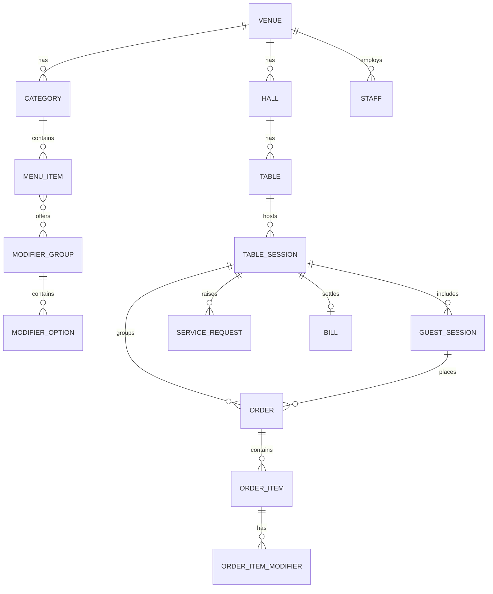
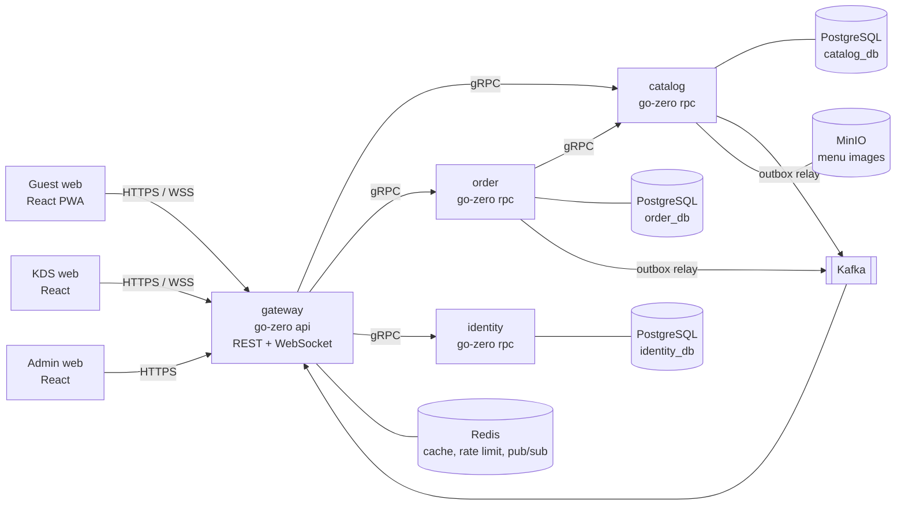
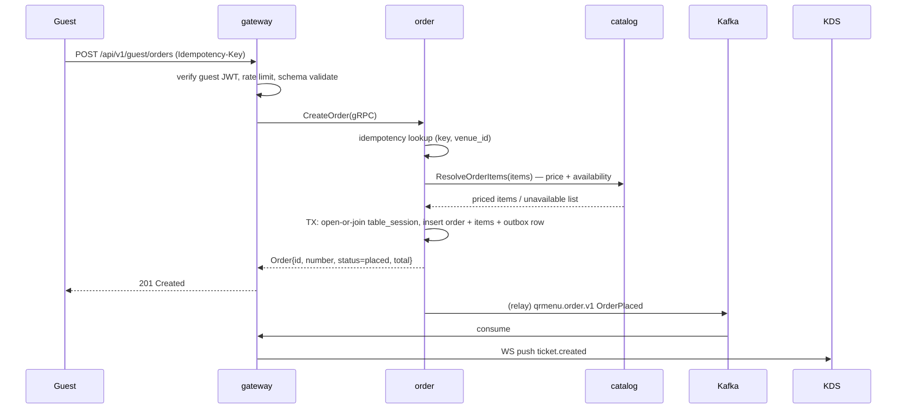

# QR Menu — Technical Specification (TZ)

| Field | Value |
|---|---|
| Product | QR Menu — contactless menu, ordering and kitchen display for cafés and restaurants |
| Document | Technical Specification (TZ), v1.0 |
| Status | Draft — for review |
| Scope | MVP (Release 1) |
| Date | 2026-08-31 |
| Owner | menli |
| Repository | https://github.com/menli02/QR-menu |

---

## 1. Summary

A guest scans a QR code printed on the table, opens a mobile web menu (no app install),
adds items to a cart, and places an order. The order appears within seconds on the
Kitchen Display System (KDS) in the kitchen. Kitchen staff move items through cooking
states; the guest sees live order status on the same page. The guest can also call a
waiter and request the bill from the phone. Payment itself happens off-system
(cash / card terminal at the table) in Release 1.

**Release 1 deliberately excludes online payments**, delivery/takeaway, loyalty,
POS integration and fiscal receipts. See §3.2 Non-goals.

### 1.1 Facts, assumptions, risks

**Facts (given).**
- Target architecture: microservices from day one, per organization standard.
- Backend stack: Go + go-zero, gRPC between services, PostgreSQL, Redis, Kafka, MinIO, Kubernetes.
- Frontends: React web (guest, KDS, admin). Native mobile apps are not part of Release 1.
- Repository is public — no secrets, no real customer data, no production dumps in the repo.

**Assumptions (to confirm — see §16).**
- A1. Single-country, single-currency per venue; currency is a venue setting.
- A2. Venue Wi-Fi is available but unreliable; both guest and KDS clients must survive
  short disconnects without losing data.
- A3. Kitchen uses a tablet or a wall-mounted screen with a modern browser; no native KDS app.
- A4. No fiscalization / receipt-printing legal requirement in Release 1. If required, it
  becomes a blocking dependency for a paid pilot.
- A5. Pilot scale: up to 20 venues × 50 tables, peak ≈ 30 orders/hour/venue.
- A6. Guests are anonymous. We do not collect name, phone or email in Release 1.

**Risks.**
- R1. *QR sticker cloning / off-premise ordering.* A photographed QR lets anyone order to that
  table remotely. Mitigation: signed table token + rate limits + staff confirmation step
  (§11.3). Full mitigation (rotating codes on a table screen) is out of scope for R1.
- R2. *Kitchen adoption.* If KDS is slower than paper tickets, staff abandon it. Mitigation:
  KDS must be operable with one tap per item and must work offline-read (§5.4).
- R3. *Menu content quality.* Photos and descriptions are the venue's responsibility;
  a bad menu kills conversion regardless of the software. Mitigation: admin UI enforces
  required fields, image guidelines, and a preview mode.
- R4. *Stale menu / stop-list.* Ordering an item the kitchen ran out of causes refunds and
  conflict. Mitigation: server-side availability re-check at order submit (§7.2, §12.2).
- R5. *Public repository.* Any accidental commit of a token or a dump is immediately public.
  Mitigation: secret scanning in CI, `.gitignore` for env files, placeholders only in docs.

---

## 2. Glossary

| Term | Meaning |
|---|---|
| **Venue** | A single café/restaurant location. Tenant boundary — every row carries `venue_id`. |
| **Table** | A physical table with a printed QR code. Belongs to a venue and a hall/zone. |
| **Table session** | Period during which one party occupies a table. Groups all orders into one bill. Opened on first order, closed by staff. |
| **Guest session** | Anonymous authenticated session of one phone at one table, inside a table session. |
| **Menu item** | A sellable dish or drink with price, category and optional modifiers. |
| **Modifier** | An option affecting an item (e.g. "no onion", "double shot"), may change price. |
| **Stop-list ("86")** | Set of items temporarily unavailable. Toggled by kitchen or manager. |
| **Order** | An immutable-priced set of order items placed at one moment by one guest session. |
| **Ticket** | The KDS representation of an order. One order = one ticket. |
| **Service request** | Guest-initiated call to staff: call waiter / request bill. |
| **Bill** | Read model: sum of all non-cancelled orders in a table session. |
| **KDS** | Kitchen Display System — the kitchen screen showing tickets. |

---

## 3. Goals and scope

### 3.1 Goals

| ID | Goal | Success metric (pilot, 1 venue, 1 month) |
|---|---|---|
| G1 | Let a guest order without waiting for a waiter | ≥ 40% of tables place ≥ 1 order via QR |
| G2 | Cut time from "guest decided" to "kitchen sees the order" | p95 < 5 s from submit to ticket on KDS |
| G3 | Remove order-transcription errors | 0 order-content complaints attributable to the system |
| G4 | Give the kitchen a single source of truth for the queue | ≥ 90% of tickets closed in KDS, not on paper |
| G5 | Reduce "where is my food / bring the bill" friction | Median waiter-call acknowledgement < 60 s |

### 3.2 Non-goals for Release 1 (explicitly out of scope)

Online payments and refunds; delivery and takeaway; table reservation; loyalty, coupons,
promo codes; POS / accounting / fiscal-printer integration; inventory and cost accounting;
staff scheduling and payroll; native iOS/Android apps; multi-venue chain reporting;
guest accounts and order history across visits; tips; printer-based (paper) kitchen tickets.

Each of these has a natural place in Release 2+ (§15) and the contracts in §8 are designed
not to block them.

---

## 4. Actors and user stories

### 4.1 Actors

| Actor | Client | Auth |
|---|---|---|
| **Guest** | Mobile web (`web/guest`) | Anonymous guest JWT bound to venue+table+session |
| **Waiter** | Mobile web (`web/kds`, floor view) | Staff JWT, role `waiter` |
| **Cook / kitchen** | Tablet or wall screen (`web/kds`) | Staff JWT, role `cook` |
| **Manager** | Desktop web (`web/admin`) | Staff JWT, role `manager` |
| **Venue admin/owner** | Desktop web (`web/admin`) | Staff JWT, role `admin` |
| **Platform operator** | CLI / runbooks | Out of product scope; K8s + DB access |

### 4.2 User stories (Release 1)

**Guest**
- US-G1. As a guest I scan the QR on my table and instantly see the menu of this venue,
  with the table number already recognised, without installing anything or signing in.
- US-G2. I browse by category, see photo, description, price, allergens and whether an item
  is available right now.
- US-G3. I add items to a cart, choose modifiers, set quantity and leave a comment
  ("no ice", "well done").
- US-G4. I submit the order and immediately get an order number and live status.
- US-G5. I add more items later; they join the same bill.
- US-G6. I press "Call waiter" or "Bring the bill" and see that the request was received.
- US-G7. I see the running total of everything ordered at my table.
- US-G8. If my connection drops, my cart is not lost and the page recovers status on reconnect.

**Kitchen (cook)**
- US-K1. New tickets appear on the KDS within seconds, sorted oldest-first, with table number,
  order number, items, modifiers and comments.
- US-K2. I accept a ticket, mark individual items as cooking → ready, and close the ticket.
- US-K3. I see how long each ticket has been waiting; overdue tickets are visually escalated.
- US-K4. I put an item on the stop-list when we run out; it disappears from the guest menu.
- US-K5. If the screen loses network, it shows a clear offline indicator and re-syncs on reconnect.

**Waiter**
- US-W1. I see active waiter calls and bill requests per table and acknowledge them.
- US-W2. I see ready orders to be delivered and mark them served.
- US-W3. I open the bill for a table, and after payment I mark it paid with a method
  (cash / card terminal) which closes the table session.
- US-W4. I can cancel an order or an item before it is cooking, with a reason.

**Manager / admin**
- US-A1. I create and edit categories, items, prices, modifiers, photos, allergens, and
  publish menu changes.
- US-A2. I manage tables and halls and print/download QR codes as a PDF sheet.
- US-A3. I manage staff accounts and roles.
- US-A4. I configure venue settings: name, logo, currency, locales, working hours,
  service charge %, order rules.
- US-A5. I see a basic day report: orders count, revenue by order, average ticket,
  top items, average cook time.

---

## 5. Functional requirements

Priority: **M** = must (Release 1), **S** = should (Release 1 if time allows), **C** = could (Release 2).

### 5.1 Catalog and menu

| ID | Pri | Requirement |
|---|---|---|
| FR-C1 | M | Category CRUD: name (per locale), sort order, visibility, optional image. |
| FR-C2 | M | Menu item CRUD: name and description per locale, base price (minor units), category, photo, allergen tags, `is_active`, sort order. |
| FR-C3 | M | Modifier groups: name, min/max selectable, required flag; options with price delta. An item references 0..N modifier groups. |
| FR-C4 | M | Availability toggle (stop-list) per item, settable from admin and from KDS; changes propagate to guest clients in ≤ 5 s. |
| FR-C5 | M | Guest menu read endpoint returns only active, visible, in-locale content for one venue, in a single response, cacheable. |
| FR-C6 | S | Menu versioning: publishing produces a new immutable `menu_version`; guest clients cache by version. |
| FR-C7 | S | Item scheduling (breakfast 08:00–11:00) via availability windows. |
| FR-C8 | C | Item options such as size variants modelled as modifier groups (no separate SKU concept in R1). |

### 5.2 Tables and QR

| ID | Pri | Requirement |
|---|---|---|
| FR-T1 | M | Table CRUD: label ("12", "Terrace-3"), hall/zone, seats, `is_active`. |
| FR-T2 | M | Each table has an immutable `table_code` (random, ≥ 10 chars, URL-safe) and a signature `sig` derived from an HMAC key with a `key_version`. |
| FR-T3 | M | QR export: PNG per table and a printable A4 PDF sheet for all tables of a hall, including venue logo and table label. |
| FR-T4 | M | Key rotation: rotating the venue HMAC key invalidates old QR codes and requires reprint; old `key_version` stays valid for a configurable grace period (default 30 days). |
| FR-T5 | S | Deactivating a table blocks new orders with a clear message and keeps history. |

### 5.3 Guest session and ordering

| ID | Pri | Requirement |
|---|---|---|
| FR-O1 | M | Opening a valid QR link issues an anonymous guest JWT bound to `venue_id`, `table_id`, `guest_session_id`; TTL 4 h, sliding on activity. |
| FR-O2 | M | Cart lives on the client (localStorage) and survives reload; it is never trusted for pricing. |
| FR-O3 | M | Order submit sends item ids, modifier option ids, quantity and comment only. The server resolves the current price and stores a **price snapshot** on every order item. |
| FR-O4 | M | Order submit is idempotent via a client-generated `Idempotency-Key` (UUIDv4); retries return the original result (§7.4). |
| FR-O5 | M | Server validates on submit: item exists, active, available, belongs to the venue; modifier selection satisfies min/max; quantity 1..99; comment ≤ 200 chars; items per order ≤ 50; order total ≤ venue limit. |
| FR-O6 | M | If any item became unavailable, submit fails with `409 ITEMS_UNAVAILABLE` and the exact item list. Partial acceptance is not allowed in R1. |
| FR-O7 | M | If a resolved price differs from the price the client displayed, submit fails with `409 PRICE_CHANGED` plus new totals; the guest re-confirms. |
| FR-O8 | M | On success the order gets a per-venue, per-business-day human number (`A-014`) and enters state `placed`. |
| FR-O9 | M | The first order at a free table opens a `table_session`; later orders from any guest at that table join it. |
| FR-O10 | M | The guest sees live order status and the running table total. |
| FR-O11 | S | Guest can cancel own order within `cancel_window` (default 60 s) while it is still `placed`. |
| FR-O12 | C | Split bill / per-guest bill. |

### 5.4 Kitchen display (KDS)

| ID | Pri | Requirement |
|---|---|---|
| FR-K1 | M | Ticket list per venue, filtered by station (`all` in R1), sorted by placed time ascending. |
| FR-K2 | M | New tickets arrive push-based (WebSocket) in ≤ 2 s p95, with an audible and visual alert. |
| FR-K3 | M | Per-ticket actions: accept, start, mark ready, close (served); per-item actions: cooking, ready, cancel. |
| FR-K4 | M | Elapsed timer per ticket; colour escalation at configurable thresholds (default green < 8 min, amber 8–15, red > 15). |
| FR-K5 | M | An order becomes `ready` automatically when all non-cancelled items are `ready`. |
| FR-K6 | M | Stop-list toggle directly from a ticket item ("86 this"). |
| FR-K7 | M | Offline mode: last state stays readable, a banner shows disconnection, actions are queued and replayed with idempotency keys on reconnect; conflicting server state wins and is shown. |
| FR-K8 | S | Recall of a closed ticket within 30 min. |
| FR-K9 | C | Multiple stations (bar/hot/cold) with per-station routing. |

### 5.5 Service requests and bill

| ID | Pri | Requirement |
|---|---|---|
| FR-S1 | M | Guest can create a service request of type `call_waiter` or `request_bill`. |
| FR-S2 | M | Rate limit: one open request per type per table; a repeat within 2 min returns the existing one. |
| FR-S3 | M | Staff floor view lists open requests with table, type, age; staff can `acknowledge` and `resolve`. |
| FR-S4 | M | Open requests auto-expire to `expired` after 15 min (configurable) and are logged. |
| FR-S5 | M | Bill view per table session: line items across orders, subtotal, service charge %, total. |
| FR-S6 | M | Staff marks the bill paid with method `cash` / `card_terminal` / `other`; this closes the table session and archives it. Amount received and change are not tracked in R1. |
| FR-S7 | S | `request_bill` carries a preferred payment method hint from the guest. |

### 5.6 Admin and reporting

| ID | Pri | Requirement |
|---|---|---|
| FR-A1 | M | Staff CRUD with roles `admin`, `manager`, `waiter`, `cook`; password policy per §11.3. |
| FR-A2 | M | Venue settings: name, logo, currency, locales, timezone, business-day cutoff, service charge %, KDS thresholds, order limits. |
| FR-A3 | M | Day report: orders, revenue, average ticket, top 10 items, average accept and cook time. |
| FR-A4 | M | Audit log of privileged actions (price change, order cancel, bill paid, staff role change) with actor, before/after, timestamp. |
| FR-A5 | S | CSV export of the day report. |

---

## 6. Domain model



Aggregate roots and their owning service:

| Aggregate | Owner service | Notes |
|---|---|---|
| Venue, Hall, Table, Category, MenuItem, ModifierGroup | `catalog` | Read-heavy, cacheable |
| TableSession, GuestSession, Order, OrderItem, ServiceRequest, Bill | `order` | Write-heavy, transactional |
| Staff, Role, Session/refresh token | `identity` | Auth only |

No cross-service foreign keys. `order` stores denormalized snapshots (item name, price,
modifier names) so that a menu edit never rewrites history.

---

## 7. Architecture

### 7.1 Services



| Service | Type | Responsibility | Why separate |
|---|---|---|---|
| `gateway` | go-zero **api** (REST + WS) | Edge: TLS termination behind ingress, authn, rate limiting, request validation, response shaping, WebSocket hubs, BFF aggregation | Only component exposed publicly; scales with connections, not with business load |
| `catalog` | go-zero **rpc** | Venues, halls, tables, categories, items, modifiers, availability, images | Read-dominated, aggressively cached, different scaling and deploy cadence |
| `order` | go-zero **rpc** | Table/guest sessions, orders, order state machine, service requests, bill | The transactional core; correctness-critical, isolated failure domain |
| `identity` | go-zero **rpc** | Staff accounts, roles, password hashing, token issue/refresh, guest token signing keys | Security-sensitive; smallest possible blast radius and audit surface |

**Explicitly not services in R1:** notification/realtime (lives in `gateway`), reporting
(read queries in `order` + `catalog`), media processing (synchronous resize in `catalog`).
Each is called out in §15 with the trigger that would justify extraction.

### 7.2 Key interaction flows

**Order submit (synchronous path).**



Timeouts: gateway→order 3 s, order→catalog 800 ms, DB statement 2 s. No retries on
`CreateOrder` inside the server (the client retries with the same idempotency key);
`ResolveOrderItems` is retried once (it is a pure read).

**Kitchen status change.** KDS → gateway (REST, staff JWT, idempotency key) → order
(state machine transition in one TX + outbox) → Kafka → gateway → WS push to the guest's
order channel and to all KDS clients of the venue.

**Availability toggle.** KDS/admin → gateway → catalog (TX + outbox) → Kafka
`qrmenu.catalog.v1 ItemAvailabilityChanged` → gateway → WS push to guest menu channel;
guest UI marks the item unavailable without a full menu reload.

### 7.3 Realtime design

- **Kafka** carries durable domain events (audit, analytics, future consumers). It is *not*
  the low-latency path to browsers.
- **gateway** instances consume Kafka with a **per-instance consumer group**
  (`gateway-<pod-name>`) so every instance receives every event and can push to the sockets
  it holds. Consumers are read-only and idempotent, so per-pod groups are safe.
  *Alternative considered:* Redis Pub/Sub fan-out. Rejected as the primary path because it
  would need its own delivery guarantees; kept as the fallback if per-pod groups become
  operationally noisy (see ADR-0003).
- WebSocket channels: `venue:{venue_id}:kds`, `venue:{venue_id}:menu`,
  `session:{table_session_id}` (guest). Subscription is authorised from the JWT claims;
  a guest can only subscribe to its own table session.
- Client reconnect: exponential backoff 1→30 s with jitter; on reconnect the client
  **re-fetches state over REST** and then resumes the socket. Sockets are an optimisation,
  never the source of truth.
- Guest fallback: if WS fails twice, poll `GET /api/v1/guest/orders` every 10 s.
- Heartbeat: ping every 25 s, drop after 2 missed pongs.

### 7.4 Idempotency, retries, timeouts

| Concern | Rule |
|---|---|
| Idempotency scope | All state-changing public endpoints require `Idempotency-Key` (UUIDv4). Key is scoped to `(venue_id, endpoint, key)`. |
| Storage | `order_db.idempotency_key` — key, request fingerprint (SHA-256 of canonical body), response status + body, `created_at`. TTL 24 h, purged by a daily job. |
| Replay | Same key + same fingerprint → stored response. Same key + different fingerprint → `409 IDEMPOTENCY_KEY_REUSED`. |
| In-flight | A second request while the first is running gets `409 REQUEST_IN_PROGRESS` (row lock with `SELECT ... FOR UPDATE NOWAIT`). |
| Retries | Clients retry `5xx`/timeouts with backoff and the same key. Servers do not retry writes. Reads may be retried once. |
| Timeouts | Browser→gateway 10 s; gateway→rpc 3 s; rpc→rpc 800 ms; DB statement 2 s; `lock_timeout` 1 s. |
| Circuit breaking | go-zero built-in breaker on every gRPC client; `catalog` unavailable → order submit fails fast with `503 CATALOG_UNAVAILABLE`, KDS keeps working on already-placed orders. |

---

## 8. Contracts

Contracts are long-lived interfaces. Rules: additive changes only within a major version;
`buf breaking` runs in CI against `main`; a breaking change requires a new package version
(`order.v2`) and a documented migration window. Never reuse or renumber a proto field.

### 8.1 Public REST API (gateway, `/api/v1`)

Money is always integer **minor units** plus an ISO-4217 `currency`. All timestamps are
RFC 3339 UTC. All list endpoints are cursor-paginated.

**Guest (auth: guest JWT in `Authorization: Bearer`, issued from the QR link)**

| Method | Path | Purpose | Notes |
|---|---|---|---|
| `POST` | `/guest/sessions` | Exchange `{venue_slug, table_code, sig}` for a guest JWT | Rate limited per IP; validates HMAC |
| `GET` | `/guest/menu` | Full menu for the venue in the requested locale | `ETag` + `Cache-Control: max-age=60`; returns `menu_version` |
| `POST` | `/guest/orders` | Place an order | `Idempotency-Key` required |
| `GET` | `/guest/orders` | Orders of the current table session with statuses | |
| `POST` | `/guest/orders/{id}/cancel` | Cancel own order inside the cancel window | |
| `GET` | `/guest/bill` | Current table-session bill | |
| `POST` | `/guest/service-requests` | `{type: call_waiter\|request_bill}` | Rate limited |
| `WS` | `/ws/guest` | Live order and menu updates | Token in the first message, not the query string |

**Staff (auth: staff JWT; role checks per §11.3)**

| Method | Path | Purpose |
|---|---|---|
| `POST` | `/auth/login` / `/auth/refresh` / `/auth/logout` | Session lifecycle |
| `GET` | `/kds/tickets?status=active` | Ticket list for the venue |
| `POST` | `/kds/orders/{id}/transition` | `{to: accepted\|in_progress\|ready\|served\|cancelled, reason?}` |
| `POST` | `/kds/order-items/{id}/transition` | `{to: cooking\|ready\|cancelled, reason?}` |
| `POST` | `/kds/items/{item_id}/availability` | Stop-list toggle |
| `GET` | `/floor/service-requests?status=open` | Open guest requests |
| `POST` | `/floor/service-requests/{id}/transition` | `{to: acknowledged\|resolved}` |
| `GET` | `/floor/tables` | Table map with session state and totals |
| `GET` | `/floor/table-sessions/{id}/bill` | Bill for a table |
| `POST` | `/floor/table-sessions/{id}/close` | `{payment_method}` — marks paid, closes session |
| `WS` | `/ws/staff` | Ticket and service-request stream |

**Admin (role `manager`/`admin`)** — CRUD under `/admin/categories`, `/admin/items`,
`/admin/modifier-groups`, `/admin/tables`, `/admin/halls`, `/admin/staff`,
`/admin/venue`, plus `GET /admin/reports/day?date=`, `GET /admin/tables/qr.pdf`.

**Error envelope** (all non-2xx):

```json
{
  "error": {
    "code": "ITEMS_UNAVAILABLE",
    "message": "Some items are no longer available",
    "details": [{"item_id": "…", "name": "Latte"}],
    "trace_id": "6f1c…"
  }
}
```

Codes are a closed, documented set (`VALIDATION_FAILED`, `UNAUTHENTICATED`, `FORBIDDEN`,
`NOT_FOUND`, `ITEMS_UNAVAILABLE`, `PRICE_CHANGED`, `INVALID_TRANSITION`,
`IDEMPOTENCY_KEY_REUSED`, `REQUEST_IN_PROGRESS`, `RATE_LIMITED`, `TABLE_INACTIVE`,
`SESSION_CLOSED`, `CATALOG_UNAVAILABLE`, `INTERNAL`). HTTP status is derived from the code.

### 8.2 gRPC (internal)

Sketch — full definitions live in `proto/`, generated with `buf` + `goctl`.

```protobuf
// proto/catalog/v1/catalog.proto
service CatalogService {
  rpc GetMenu(GetMenuRequest) returns (GetMenuResponse);
  rpc ResolveOrderItems(ResolveOrderItemsRequest) returns (ResolveOrderItemsResponse);
  rpc SetItemAvailability(SetItemAvailabilityRequest) returns (SetItemAvailabilityResponse);
  rpc ResolveTable(ResolveTableRequest) returns (ResolveTableResponse);
}

message ResolveOrderItemsRequest {
  string venue_id = 1;
  repeated RequestedItem items = 2;   // item_id, qty, modifier_option_ids, comment
  string locale = 3;
}
message ResolveOrderItemsResponse {
  repeated ResolvedItem items = 1;    // snapshot: name, unit_price_minor, modifiers, line_total
  repeated UnavailableItem unavailable = 2;
  int64 total_minor = 3;
  string currency = 4;
  string menu_version = 5;
}
```

```protobuf
// proto/order/v1/order.proto
service OrderService {
  rpc CreateOrder(CreateOrderRequest) returns (Order);              // idempotency_key required
  rpc TransitionOrder(TransitionOrderRequest) returns (Order);
  rpc TransitionOrderItem(TransitionOrderItemRequest) returns (Order);
  rpc ListTickets(ListTicketsRequest) returns (ListTicketsResponse);
  rpc GetTableSession(GetTableSessionRequest) returns (TableSession);
  rpc CloseTableSession(CloseTableSessionRequest) returns (TableSession);
  rpc CreateServiceRequest(CreateServiceRequestRequest) returns (ServiceRequest);
  rpc TransitionServiceRequest(TransitionServiceRequestRequest) returns (ServiceRequest);
  rpc GetDayReport(GetDayReportRequest) returns (DayReport);
}
```

```protobuf
// proto/identity/v1/identity.proto
service IdentityService {
  rpc Login(LoginRequest) returns (TokenPair);
  rpc Refresh(RefreshRequest) returns (TokenPair);
  rpc Revoke(RevokeRequest) returns (RevokeResponse);
  rpc GetStaff(GetStaffRequest) returns (Staff);
  rpc ListJWKS(ListJWKSRequest) returns (JWKS);   // gateway verifies tokens offline
}
```

Conventions: every request carries `venue_id` where applicable; every response of a mutation
returns the full updated aggregate (no partial patches); enums always have a `_UNSPECIFIED = 0`
member; `google.protobuf.Timestamp` for time; money as `int64` minor units + `string currency`.

### 8.3 Kafka events

| Topic | Key | Partitions (pilot) | Retention | Producer |
|---|---|---|---|---|
| `qrmenu.order.v1` | `order_id` | 6 | 7 d | `order` |
| `qrmenu.service_request.v1` | `table_id` | 3 | 7 d | `order` |
| `qrmenu.catalog.v1` | `item_id` | 3 | 7 d | `catalog` |
| `qrmenu.<topic>.dlq` | original key | 1 | 30 d | consumers |

Envelope (JSON in R1; a schema registry with Protobuf is a Release 2 item):

```json
{
  "event_id": "uuid",
  "event_type": "order.placed",
  "schema_version": 1,
  "occurred_at": "2026-08-31T10:12:03Z",
  "venue_id": "uuid",
  "trace_id": "…",
  "payload": { }
}
```

Event types R1: `order.placed`, `order.transitioned`, `order.item_transitioned`,
`order.cancelled`, `table_session.opened`, `table_session.closed`,
`service_request.created`, `service_request.transitioned`,
`catalog.item_availability_changed`, `catalog.menu_published`.

Delivery rules:
- **Producing:** transactional outbox. The domain write and the `outbox` insert happen in one
  Postgres transaction; a relay goroutine publishes and marks rows sent. No event is ever
  published for a rolled-back transaction, and no transaction is lost if Kafka is down.
- **Consuming:** at-least-once, therefore every consumer is idempotent. Dedupe by `event_id`
  (Redis `SETNX` with 24 h TTL, backed by a unique constraint where a DB write is involved).
- **Ordering:** guaranteed per key only. Consumers must tolerate out-of-order arrival across
  keys and use `occurred_at` + state-machine guards rather than assuming order.
- **Failure:** 5 attempts with exponential backoff (1s, 2s, 4s, 8s, 16s), then the message
  goes to the topic's DLQ with the failure reason in headers. DLQ depth is alerted on.
- **Replay:** all consumers must be safe to replay from the beginning of retention.
- **Versioning:** additive fields only; a breaking payload change means a new topic suffix
  (`qrmenu.order.v2`) with dual-publishing during migration.
